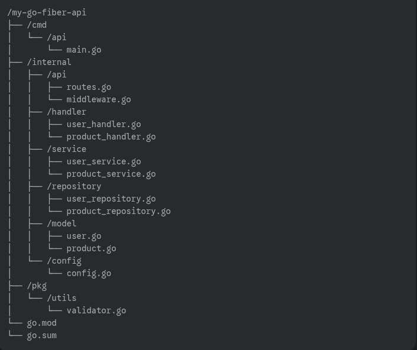

# Fiber Getting Started

---

## Table of Content

* [File Structure](#file-structure)
    * [Monorepo Structure](#monorepo-structure)
    * [/cmd](#cmd)
    * [/internal](#internal)
        * [/api](#api)
        * [/handler](#handler)
        * [/service](#service)
        * [/repository](#repository)
        * [/model](#model)
        * [/config](#config)
    * [/pkg](#pkg)
    * [main project files](#main-project-files)

---

## File Structure

### Monorepo Structure

A typical monorepo structure for a Go Fiber API looks like this:

### /cmd

This directoy holds the main entry points for your applicatioon. Each executable
component should have its own subdirectory. In this case, main.go inside /cmd/api is the starting
point for your API.

### /internal

This is a crucail directory for keeping your application's private code. The Go compiler prevents
other projects from importing code from an internal directory, ensuring that your core logic remains
self-contained.

#### /api

Contains API-specific components like route definitions and middleware.

#### /handler

Houses the request handlers. Each handler is reponsible for processing
incoming requests, coordinating with services, and sending responses. They are the "controllers"
of the API.

#### /service

Contains the business logic. Services abstruct the business rules and are called
by the handlers. They interact with the repositories to perform operations.

#### /repository

Managers data persistance. Repositories are responsible for interacting with the database or
any other storage system.

#### /model

Defines the data structure or schemas (eg., User, Product). These are
used throughout the applicatioon to represent data.

#### /config

Stores application configuration settings, such as database connectioon string or API keys.

### /pkg

This directory is for code that can be safely used and imported by other applications.
For example, a shared validator utility could be placed here.

### main project files

go.mod and go.sum: These files are essential for managing your project's dependencies
using Go Modules. They track the versions of all external packages your API uses.

---